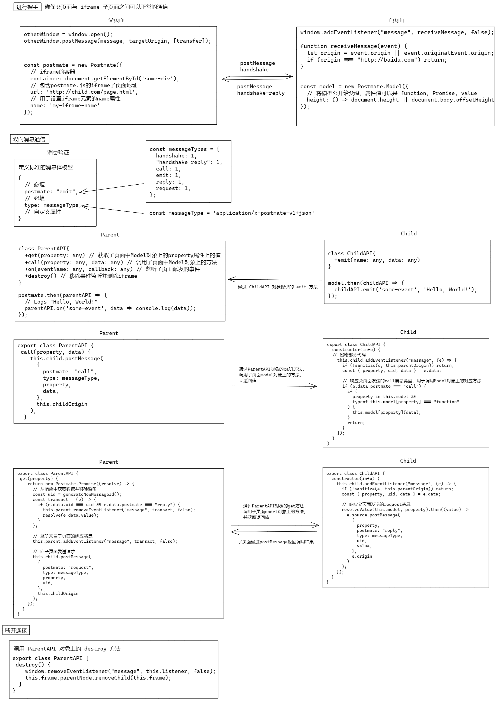

# `postMate`使用教程

## 特征

- 基于 Promise 的 API，可实现优雅，简单的通信。

- 通过消息验证来保护双向 `Parent`<->`Child` 握手。
- `Child` 公开了`Parent`可以访问的可检索模型对象。
- `Child` 发出`Parent`可以监听的事件。
- `Parent`可以在`Child` 中调用函数。
- 零依赖性。 如果需要，为 Promise API 提供您自己的 polyfill 或抽象。
- 轻巧，重约 1.6kb（minified & gzipped）。

> 虽然基础机制是 window.postMessage()，但仅支持 iFrame。

## 安装

​ `$ yarn add postmate`

## 使用

1. `Parent`开始与`Child`沟通。 发送握手，`Child`以握手回复作为响应，完成`Child`/`Parent`初始化。 两者已绑定，可以安全地进行通信了。

2. `Parent`通过属性名称从`Child`获取值。 `Child`可以向`Parent`发送消息。 `Parent`可以在`Child`模型中调用函数。

   
